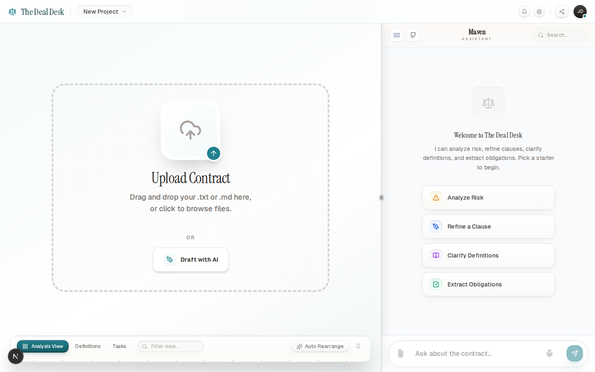

# The Deal Desk

**Winner — Tambo "UI Strikes Back" Hackathon**

An AI-native contract workspace where the UI adapts to what you're trying to do: assess risk, refine clauses, clarify definitions, and track obligations.

Unlike traditional legal platforms that force you into rigid dashboards and fixed workflows, The Deal Desk flips the paradigm. You drop in a contract, ask what you need in natural language, and the interface reshapes itself around your job to be done — surfacing the right interactive tool at the right time. The Deal Desk makes contracts readable for non-lawyers. Because navigating legalese shouldn't be the hardest part of your job.

**[Live Website](https://deal-desk-tambo.vercel.app/)** · **[Watch Demo](https://youtu.be/V0RTi8uorJM)** · **[Source Code](https://github.com/wafflebytes/DealDesk-Tambo)**

---

[](https://youtu.be/V0RTi8uorJM)


### Screenshots

| Landing Page | Workspace |
| :---: | :---: |
|  |  |

---

## Key Features

This project goes beyond "chat on the side". Tambo serves as the control plane for the entire workspace — the AI doesn't just answer, it builds the interface.

- **Drag-and-Drop GenUI Canvas** — The AI responds with purpose-built interactive components instead of text. Drag them onto a persistent canvas, rearrange freely, and keep them around as you work through the contract.

- **Skeuomorphic Workspace Design** — The desk is designed to feel physical and calm: layered paper textures, soft gradients, and tactile controls. Every interaction has weight.

- **Rich Contract Editor** — A full TipTap-based editor with real-time context awareness. Select a clause, and the AI understands exactly what you're looking at.

- **Multi-Agent Orchestration** — Behind a single chat input, a coordinator routes requests to five specialized agents. Each one returns typed, schema-validated data that maps directly to a UI component.

- **Elicitation UI** — When a request is ambiguous, the AI doesn't guess. It surfaces a structured clarification card (choice selection, form input, or confirmation dialog) to collect what it needs before proceeding.

- **Resizable, Responsive Layout** — Editor, chat, and canvas panels resize fluidly. The entire product remains usable on mobile.

---

## Architecture

At its core, The Deal Desk uses a multi-agent routing system paired with strongly typed generative components. Every user message flows through a single orchestration pipeline.

```
User prompt
  → Chat UI (useTamboThread)
    → Tambo orchestration layer
      → Coordinator tool (classifies intent, routes to sub-agent)
        → Risk Analyst / Clause Negotiator / Definition Curator /
           Obligation Extractor / Scoping Specialist
          → Returns typed props validated against Zod schema
            → GenUI component renders in the workspace
```

### Specialized Agents

The coordinator (`components/agents/coordinator.ts`) classifies each user query with keyword matching and confidence scoring, then delegates to the right sub-agent:

| Agent | Role | Output Component |
|---|---|---|
| **Risk Analyst** | Scores contract risk across Liability, IP, Term, Payment, Confidentiality | `RiskRadar` |
| **Clause Negotiator** | Generates interactive sliders and toggles for clause parameter tuning | `ClauseTuner` |
| **Obligation Extractor** | Pulls out duties, deadlines, and action items with priority levels | `ExtractionChecklist` |
| **Definition Curator** | Extracts and organizes defined terms into a searchable glossary | `KnowledgeBank` |
| **Scoping Specialist** | Surfaces clarification UI when the user's request is ambiguous | `ScopingCard` |

### Generative UI Components

Each component is registered with Tambo alongside a Zod `propsSchema`, ensuring that every AI-generated response is fully type-safe. The schemas live in `components/genui/schemas.ts`.

| Component | Schema | What it renders |
|---|---|---|
| `RiskRadar` | `DealRiskSchema` | Radar chart of 5 risk dimensions (0–1 scores) with follow-up suggestions |
| `ClauseTuner` | `ClauseTunerSchema` | 1–3 sliders + 0–2 toggles for adjusting clause parameters (caps, days, mutual liability) |
| `ExtractionChecklist` | `ChecklistSchema` | Priority-tagged task list with source references (e.g. "Section 4.1") |
| `KnowledgeBank` | `DefinitionBankSchema` | Searchable grid of defined terms with tags |
| `ScopingCard` | `ScopingSchema` | Three variants — `v1` (enum choice), `v2` (form input), `v3` (destructive confirm) |

---

## Tambo Integration

Tambo is deeply wired into every layer. This is not a wrapper — it is the runtime that powers the product.

| Tambo Primitive | Where it's used | Purpose |
|---|---|---|
| `TamboProvider` | `components/providers/tambo-wrapper.tsx` | Registers all components, tools, and the system prompt for Maven |
| `useTamboThread()` | `components/deal-desk/tambo-chat.tsx` | Streaming chat, message dispatch, and response handling |
| `useTamboThreadList()` | `components/deal-desk/thread-drawer.tsx` | Thread history, switching between conversations |
| `useTamboComponentState()` | All GenUI components | Persistent UI state across re-renders and sessions |
| `useTamboContextHelpers()` | `components/deal-desk/document-editor.tsx` | Attaches active document text and user selection as context |
| `TamboTool` + Zod | All agent files in `components/agents/` | Typed tool definitions with validated input/output schemas |

### System prompt

Maven, the AI persona powering the workspace, operates under strict constraints:
- When rendering a component, output zero text. The component *is* the response.
- No markdown formatting. Plain text only when text is necessary.
- Maximum 30 words for any text-only reply. Most responses are 0 words.

---

## Project Structure

```
app/
  page.tsx                          # Landing page
  desk/page.tsx                     # Workspace

components/
  providers/
    tambo-wrapper.tsx               # TamboProvider setup, component + tool registry

  agents/
    coordinator.ts                  # Intent classifier + orchestrator (called first)
    risk-analyst.ts                 # Risk scoring agent
    clause-negotiator.ts            # Clause parameter tuning agent
    definition-curator.ts           # Term extraction agent
    obligation-extractor.ts         # Obligation/task extraction agent
    scoping-specialist.ts           # Elicitation/clarification agent

  deal-desk/
    tambo-chat.tsx                  # Chat panel (useTamboThread)
    document-editor.tsx             # TipTap editor + context attachment
    canvas-pane.tsx                 # Draggable GenUI canvas
    risk-radar.tsx                  # RiskRadar component
    clause-tuner.tsx                # ClauseTuner component
    extraction-checklist.tsx        # ExtractionChecklist component
    definition-bank.tsx             # KnowledgeBank component
    scoping-card.tsx                # ScopingCard component (3 variants)
    thread-drawer.tsx               # Thread history sidebar

  genui/
    schemas.ts                      # Zod schemas for all GenUI props
```

---

## Future Work

Directions we'd explore next:

- **Interactables** — Use `withInteractable` / `useTamboInteractable` so the model can observe and manipulate on-screen controls directly, not just render new components.
- **Suggestions** — Surface contextual next steps via `useTamboSuggestions()` (e.g. "Check assignment clause", "Extract renewal dates").
- **Voice input** — Enable hands-free contract review on mobile with `useTamboVoice()`.
- **MCP integration** — Connect clause libraries, negotiation playbooks, and approval rules through MCP servers.
- **Routing improvements** — Experiment with model-based intent classification and confidence thresholds for more reliable component selection.

---

## Getting Started

### Prerequisites

- Node.js 18+
- A [Tambo API key](https://tambo.ai)

### Install

```bash
npm install
```

### Configure

Create a `.env.local` file in the project root:

```
NEXT_PUBLIC_TAMBO_API_KEY=your_key_here
```

### Run

```bash
npm run dev
```

Open your browser:

- **Landing** — [http://localhost:3000](http://localhost:3000)
- **Workspace** — [http://localhost:3000/desk](http://localhost:3000/desk)
