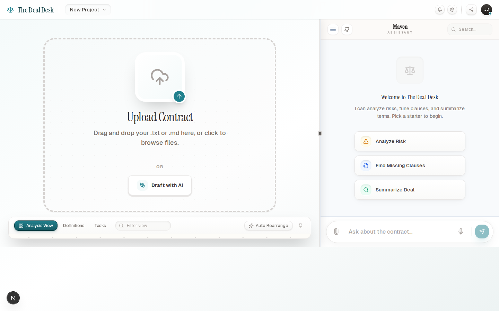
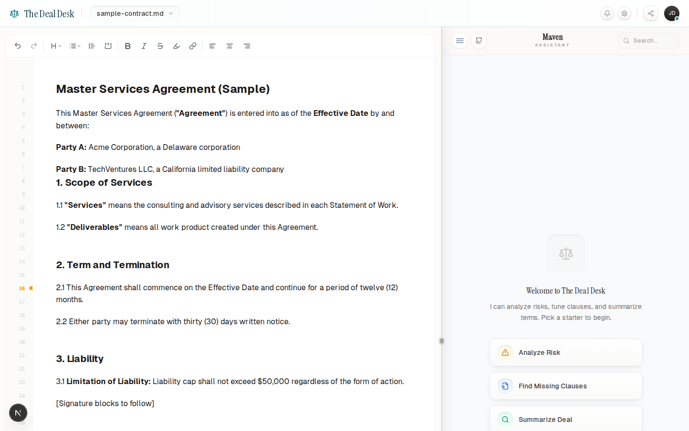
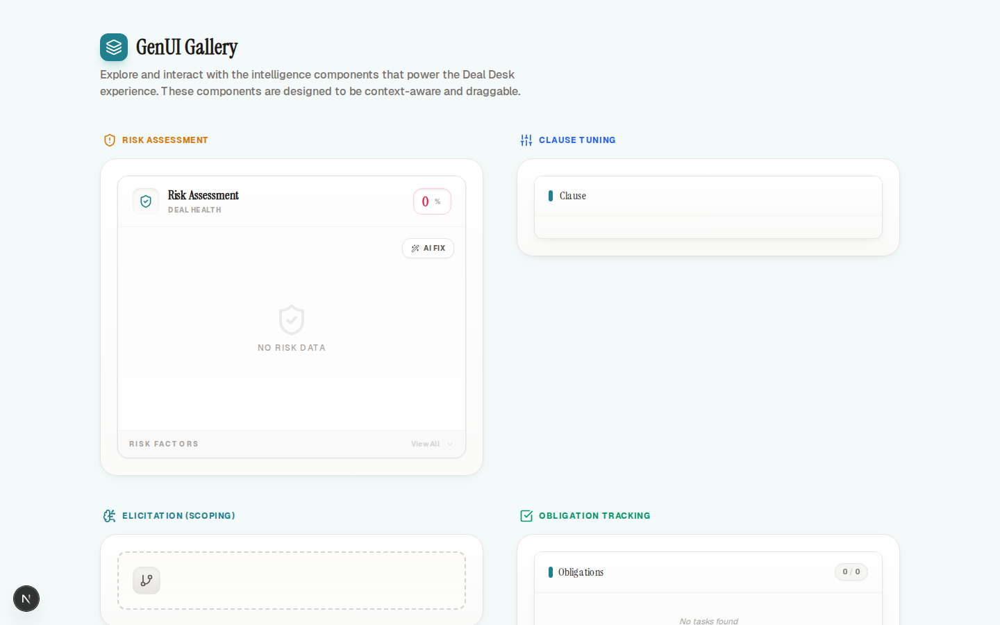

# The Deal Desk (Tambo GenUI)

An AI-powered contract negotiation workspace: upload a contract, ask Maven (the assistant) for analysis, and turn AI outputs into interactive UI cards you can drag into a decision canvas.

This project is *not* the default Tambo chat template UI. The product experience, GenUI components, orchestration, and “canvas” workflow are custom-built on top of the Tambo SDK.

## Screenshots

Landing (desktop)



App (desktop)



App (mobile)


GenUI gallery (desktop)



## Why this matters (Potential Impact)

Contract review is often blocked by two things:

1. *Too much context in one place:* risk, obligations, definitions, negotiation posture.
2. *Outputs that aren’t actionable:* static summaries don’t turn into decisions.

The Deal Desk turns model outputs into *interactive building blocks* (GenUI cards) and a *canvas workflow* that helps teams move from “analysis” to “action.”

## What you can do

* Upload a contract (`.md`/`.txt`) and review it in an embedded editor.
* Chat with Maven and request:
  * Risk analysis (Radar)
  * Clause tuning (Sliders/toggles)
  * Obligation extraction (Checklist)
  * Definitions (Searchable bank)
  * Clarification (Elicitation card)
* Drag AI-rendered GenUI cards into the Canvas to build a live “deal view.”

## How it works (high level)

UI + orchestration flow:

```
User message
  -> Tambo thread (useTamboThread)
    -> Coordinator tool (route intent)
      -> Sub-agent tool (risk / obligations / definitions / scoping)
        -> GenUI component props (Zod validated)
          -> Render component in chat
            -> Drag to Canvas (dnd-kit)
```

Server-side generation flow (contract drafting + elicitation JSON):

```
Next.js route handler
  -> Tambo TypeScript SDK (@tambo-ai/typescript-sdk)
    -> threads.create + advancestream (non-streaming for simplicity)
      -> parse SSE payload -> return JSON to the client
```

## Where the key pieces live (Engineering)

* App shell + responsive layout: `app/page.tsx`
  * Tip: `/?demo=1` loads a pre-filled sample contract for quick evaluation.
* Tambo registration (GenUI components + tools): `components/providers/tambo-wrapper.tsx`
* Chat UI + streaming stage UX: `components/deal-desk/tambo-chat.tsx`
* Document editor + document context injection: `components/deal-desk/document-editor.tsx`
* Canvas + grid layout: `components/deal-desk/canvas-pane.tsx`
* Agent tools (coordinator + sub-agents): `components/agents/*`
* Example external tool: `components/tools/contract-analysis.ts`
* API routes using the Tambo TypeScript SDK:
  * Contract drafting: `app/api/draft/route.ts`
  * Elicitation JSON: `app/api/elicitation/route.ts`

## Tambo features we use (Best Use Case of Tambo)

1. *Generative UI components* via `TamboProvider` component registration
   * `RiskRadar`, `ClauseTuner`, `ExtractionChecklist`, `DefinitionBank`, `ScopingCard`
   * All components have explicit *Zod* schemas for runtime validation.

2. *Tools / function calling* to orchestrate multi-step behavior
   * Coordinator routes to specialized sub-agents (`components/agents/*`).
   * Tools are typed, schema’d, and designed to return component-ready props.

3. *Streaming + stage-aware UX*
   * `useTamboThread()` provides `generationStage` which drives the reasoning chain UI.

4. *Context helpers*
   * `useTamboContextHelpers()` adds the active document text (and current selection) as dynamic context on every message.

5. *TypeScript SDK for server routes*
   * `@tambo-ai/typescript-sdk` is used to create threads and generate:
     * full contract drafts (`/api/draft`)
     * scoping/elicitation card JSON (`/api/elicitation`)

## Creativity & Originality

Instead of treating AI as “chat + text answers,” the app pushes outputs into:

* *Actionable UI cards* (tunable sliders, checklists, searchable banks)
* A *decision canvas* to compose a deal review view
* A “UI-first assistant” contract: when a component is rendered, it is the response

## Aesthetics & UX

The UI intentionally leans into a skeuomorphic, tactile design language:

* premium “physical” controls (buttons, shadows, cards)
* fast, deterministic UI state transitions
* mobile-first layout behavior (vertical split on small screens)

## Learning & Growth

This project exercises several “real” GenUI problems:

* designing strict schemas so the model can reliably render complex components
* routing/orchestration (coordinator + sub-agents)
* combining a document editor (Tiptap) with an AI system that needs structured context
* building a drag-and-drop workflow around model-driven UI output

## Future scope (what we could use more from Tambo)

* *Interactable components* (`withInteractable`) for richer, model-aware UI state updates (beyond drag-and-drop).
* *Sampling / model controls* to tune determinism and creativity per task (e.g., risk analysis vs. drafting).
* *MCP integrations* for real deal desk workflows: CRM data, CLM systems, redline tools, approval routing.
* *Persisted threads + component state* so a deal review can be shared across a team.

## Run locally

Prereqs:

* Node.js (recommended: 22+)
* A Tambo API key (from the Tambo dashboard)
* Tambo docs: https://docs.tambo.co/

1. Install deps

```
npm install
```

2. Set environment variables

Create `.env.local`:

```
NEXT_PUBLIC_TAMBO_API_KEY=your_key
TAMBO_API_KEY=your_key  # optional server-side alias
```

If you want `/api/draft` and `/api/elicitation` to run against *your* Tambo project, update the `TAMBO_PROJECT_ID` constant in:

* `app/api/draft/route.ts`
* `app/api/elicitation/route.ts`

3. Start dev server

```
npm run dev
```

Open:

* `http://localhost:3000/` (main app)
* `http://localhost:3000/?demo=1` (pre-filled contract)
* `http://localhost:3000/components` (GenUI component gallery)

## Notes

This repo also contains `DealDesk-main/` (the upstream Tambo template app) for reference, but the hackathon project lives at the repository root.
