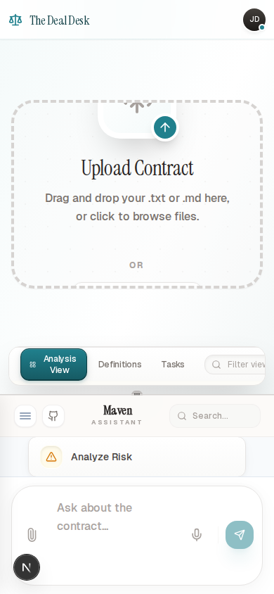

# The Deal Desk

An AI-native contract workspace where the UI adapts to what you’re trying to do: assess risk, refine clauses, clarify definitions, and track obligations.

This project is *not* the stock Tambo template UI. We built a fully custom product surface (skeuomorphic “desk” + editor + chat + draggable GenUI canvas) and wired Tambo’s generative UI primitives into it.

## Screenshots

Landing (desktop)


Deal Desk (desktop)


Deal Desk (mobile)



## Why this matters (judging criteria framing)

### Potential impact

Most contract tools force you through a dashboard and a fixed workflow. The Deal Desk flips that: you drop in a contract, ask what you need, and the interface reshapes itself around the job (risk, negotiation, obligations, definitions).

### Creativity + originality

Instead of returning text-only answers, Maven responds with purpose-built *interactive* components (GenUI) that you can drag onto a canvas and keep around as you work.

### Learning + growth

This codebase explores Tambo’s generative UI model (registered components + tools + streaming) and pairs it with a custom interaction model: a TipTap editor, resizable panes, DnD-driven “analysis canvas”, and elicitation cards for ambiguous requests.

### Technical implementation

Key building blocks:

1. **Next.js App Router UI**
   - Landing: `app/page.tsx`
   - Workspace: `app/desk/page.tsx`

2. **Tambo Provider + Registry**
   - `components/providers/tambo-wrapper.tsx` registers GenUI components + tools.

3. **Multi-agent orchestration (via Tools)**
   - `components/agents/coordinator.ts` routes each request to a specialized tool.

4. **Context-aware contract understanding**
   - `components/deal-desk/document-editor.tsx` attaches the active document (and selection) via `useTamboContextHelpers()`.

### Aesthetics + UX

The workspace is designed to feel tactile and calm (skeuomorphic controls, layered paper, soft gradients). The full frontend is responsive so it remains usable on mobile.

### Best use of Tambo

Tambo isn’t bolted on as “chat on the side”. It’s the control plane for the UI:

- You ask in natural language.
- Tambo selects and hydrates the best component.
- The component becomes the response.

## Architecture (how it works)

### High-level request flow

```
User
  ↓
Chat UI (`components/deal-desk/tambo-chat.tsx`)
  ↓  useTamboThread().sendThreadMessage()
Tambo
  ↓  tool_calls
Coordinator tool (`components/agents/coordinator.ts`)
  ↓  routes to a specialized tool
Risk Analyst | Clause Negotiator | Definition Curator | Obligation Extractor | Scoping Specialist
  ↓
Returns typed props (Zod schemas)
  ↓
GenUI component renders (RiskRadar / ClauseTuner / DefinitionBank / ExtractionChecklist / ScopingCard)
```

### Generative UI components (registered with schemas)

Registered in `components/providers/tambo-wrapper.tsx`:

- `RiskRadar` (radar visualization of category risk)
- `ClauseTuner` (interactive clause refinement controls)
- `ExtractionChecklist` (obligations/action items list)
- `KnowledgeBank` (definitions glossary)
- `ScopingCard` (elicitation UI for ambiguity and parameter collection)

Each component is paired with a Zod `propsSchema` (see `components/genui/schemas.ts`) so the AI output stays type-safe.

## Tambo features used (explicit)

- `TamboProvider` (component + tool registry) in `components/providers/tambo-wrapper.tsx`
- `useTamboThread()` in `components/deal-desk/tambo-chat.tsx` for streaming chat + message send
- `useTamboThreadList()` in `components/deal-desk/thread-drawer.tsx` for thread browsing
- `useTamboComponentState()` in multiple GenUI components for persistent UI state
- `useTamboContextHelpers()` in `components/deal-desk/document-editor.tsx` to attach the active contract + selected text
- Tooling + schemas: tools implement `TamboTool` and validate inputs/outputs with Zod

## What we’d add next (future scope)

Areas where we can go deeper on Tambo:

1. *Interactables*: use `withInteractable` / `useTamboInteractable` so the model can directly “see” and operate on on-screen UI controls (not just render components).
2. *Suggestions*: add contextual next-step suggestions via `useTamboSuggestions()` (e.g., “Check assignment clause”, “Extract renewal dates”).
3. *Richer sampling + routing*: experiment with different tool routing strategies and model settings for more reliable component selection.
4. *Voice*: try `useTamboVoice()` for hands-free review on mobile.
5. *MCP*: connect external sources (e.g., clause library, playbooks, approval rules) through MCP servers.

## Running locally

### Prereqs

- Node.js 18+
- A Tambo API key

### Setup

1. Install deps:

```
npm install
```

2. Add env vars:

```
NEXT_PUBLIC_TAMBO_API_KEY=your_key_here
```

3. Start the dev server:

```
npm run dev
```

Open:

- `http://localhost:3000/` (landing)
- `http://localhost:3000/desk` (workspace)
